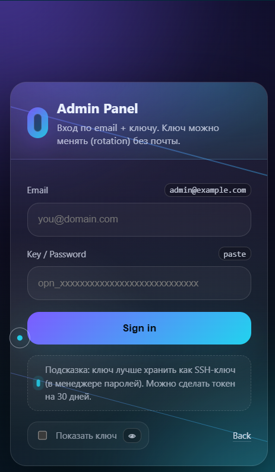

# CatalogApi

api (simple)

## Pages
- About page: [f9b3c1a2.html](wwwroot/f9b3c1a2.html) (simple)
- Login page: [login.html](wwwroot/login.html)

About login page: this page is used for user sign in.
